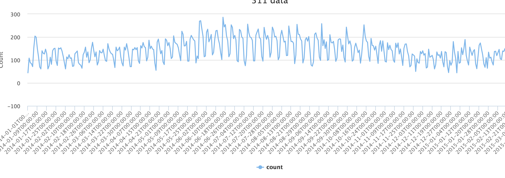
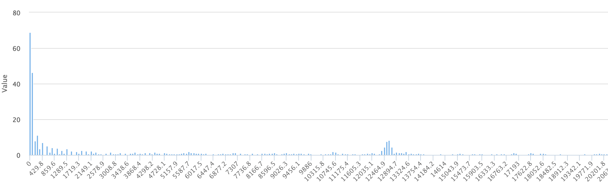

### FFT Sample application 


##### This application is a simple demonstration of FFT usage using the 311 data available through NYC OPEN DATA API

The NYC 311 data is made available through SOCRDATA API and the following end point is used for getting the data 

````
 
	URL : https://data.cityofnewyork.us/resource/erm2-nwe9.json
	$select : date_trunc_ymd(created_date) as month, count(*) as total&$group=month
    $where : $where=created_date >= '2014-01-01'   and agency_name='Department of Health and Mental Hygiene'
    $order=created_date
	
````
ALl the code relavant for this example is available in public/lib folder 


##### The above query aggregates the sum of calls made per data and the data is returned for all days starting from 1-Jan-2014 till date, The application plot two charts, one is a time series chart of number of 311 calls per day and the second chart is the frequency distribution of the calls 

### Time series calls 




### FFT 


